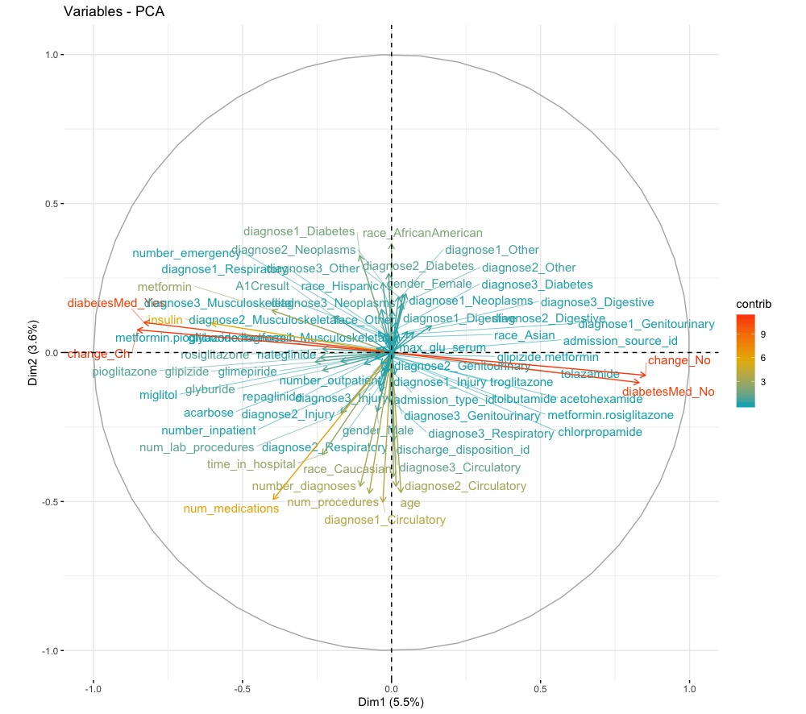

## Predicting Diabetes Readmission Rates with Neural Networks, Random Forests, and Lasso.
Team WHaMoCaTY \* - Priyam Das+, Jinwei Xing+, and Xiaojue Zhou+
\* Our team name is an abbreviation of ’We Have More Candy Than You’
\+ these authors contributed equally to this work
This Markdown File was adapted from pdf reports and adapted to website format by Xiaojue Zhou. 

## Purpose
Our group chose to work with the Diabetes 130-US Hospitals dataset for this project. This dataset contains 10 years of patient diabetes records collected from 130 hospitals in the US. 
The dataset contains 
- 101,766 records
- 49 features
- 3 class labels.
A description of the features and the amount of missing data in each category can be found at [https://www.hindawi.com/journals/bmri/2014/781670/tab1/](https://www.hindawi.com/journals/bmri/2014/781670/tab1/) so we will not spend time explaining them here.

## What we are predicting 
The 3 class labels our models will predict are 
We are trying to understand the diabete's readmission rates in relationship to other variables. Specifically, re-admission rates referred to whether or not a patient is readmitted to the hospital after the visit recorded in the database. 

- "<30" : whether the patient was readmitted in less than 30 days 
- ">30" : whether the patient was readmitted in more than 30 days
- "NO" : no record of readmission exists

## Cleaning the Data and Feature Selection

### Missing Data 

First we looked at those features with high amounts of missing data: 
- weight (97% missing, will fit model with and without) 
- payer code (not relevant for diabetes itself but maybe interesting to look in the future) 
- medical specialty (53% missing) 

We found out 97% of the weight data was missing so then we decided there was no worth in trying to include it in our analyses. We also threw out the payer code feature because the type of health insurance a patient has should have very little bearing on a patient’s care and whether they will be readmitted. We went back and forth on whether to keep medical specialty - which is a feature describing the speciality of the attending doctor. 53% of the data was missing in this category. After inspecting the values this feature could take on (84 distinct values in total) we decided it was out of scope for the project to try and reconstruct the missing values and also decided to exclude this feature from our final analyses.

We also delete these empty features: 

- examide: No patients were prescribed this drug
- citoglipton: No patients were prescribed this drug

Also, we deleted these features with less than 2 inputs 

- glimepiride
- pioglitazone
- acetohexamide
- metformin.pioglitazone
- metformin.rosiglitazone 

### Transform Data 

Comorbidity:  
The ICD-9 codes that were used as values for diag1, diag2, and diag3 (diagnoses) were remapped to 9 categorical values that indicated the type of disease:
- Circulatory
- Respiratory
- Digestive
- Diabetes
- Injury
- Musculoskeletal
- Genitourinary
- Neoplasms
- Other

Multiple visits: 
Finally, we noticed that some patient identifying numbers were repeated more than once, indicating multiple visits from the same person. In order to be able to assume independence of our data points, we only kept the first visit (as identified using encounter ids) for each patient and threw out the rest.

### Cleaned Dataset 
Out final cleaned dataset: 
- number of data points: 71,518 rows
- number of features: 38 columns

## PCA
In an attempt to reduce the number of features further, we performed a principal components analysis (PCA) but this did not prove too informative. The first principal component only accounted for 5.5% of the data. Therefore we decided to keep the rest of our features. Figure 1 shows how much each feature explains the data set. The features making the most contributions are indicator variables that say whether or not diabetes medication was prescribed to the patient and whether or not there was a change in dosage for prescribed medication. These features together accounted for 10% of the data. Whether diabetes medication was prescribed and whether there was a change are highly correlated. We suspect this may be because if a patient’s condition is worsening, then a new medication may be prescribed or a higher dosage given and thus there will be a change in dosage. Alternatively, if a patient’s condition is improving, their dosage may be decreased and this is still a change. If someone is not prescribed medicine at all, then there will be no change to administer.

## Logistic Regression
We performed some additional preprocessing of the data, namely one-hot encoding the categorical values and shuffling the data.

Figure 1. Principal components of the data and how much each accounted for the data.
with larger values as more important. After the one-hot encoding, there are 73 features to be used as coefficients in our model.
The data was also split into a training set and a test set, with the first 60,000 data points used for the training set.
We trained a multiclass logistic regression model using scikit-learn. Since there are 3 classes, we trained 3 binary classifiers.
The accuracy on the test data was 0.609. Additionally, we report the features that had the highest abstract coefficients for each
classifier.
For the <30 class (readmitted in less than 30 days), the most important factors were the number of inpatient (β = 3.899) and
emergency (β = 1.962) visits, the prescription of chlorpropamide (β = −0.897), no diabetic medicine prescribed (β = −0.865),
and the manner in which the patient was discharged (β = 0.824).
Figure 2. The 5 most important factors for the <30 classifier. Red means negative values while green means positive.
For the >30 class (readmitted after 30 days), the most important factors were the number of emergency (β = 4.285),
outpatient (β = 2.836), and inpatient (β = 2.558) visits, the prescription of miglitol (β = 1.606), and the number of diagnoses
(β = 1.285).
2/4
Figure 3. The 5 most important factors for the >30 classifier. Red means negative values while green means positive.
For the no readmission class, the most important factors were the number of emergency (β = −6.179), inpatient (β =
−5.287), and outpatient visits (β = −3.110) in the preceding year, the number of diagnoses (β = −1.820), and whether a
patient was prescribed miglitol (β = −0.792).
Figure 4. The 5 most important factors for the no readmission classifier. Red means negative values while green means
positive.
It makes sense that the values for no record of readmission and readmission after 30 days have values on opposite ends of
the scales. The features themselves make sense too, as you’re more likely to need a second visit if you’ve already been visiting
the hospital enough in the previous year and have several diagnoses.
Neural Networks
As with the logistic regression model, some preprocessing was done to the data. The data was normalized using MinMaxNormalization and was split into a training and test set, with the first 60,000 data points in the training set and the rest in the test set.
The data was also one-hot encoded as before.
Neural networks were implemented using pytorch. We tried two different network structures. Both networks had 73 input
nodes and 3 output nodes. One network had a hidden layer with 200 nodes while another network had 2 hidden layers with 200
nodes each. The batch size was 256 because we wanted a large batch for stable training. The learning rate was set at 0.0001 so
that we could track the learning process. With too high of a learning rate, the model seemed likely to overfit.
Both models achieved exactly the same accuracy of 0.601 which was surprising. It seems like the second hidden layer may
have been redundant, however when we look at plots of the loss and accuracy, we see that the two layer network converges
faster.
3/4
(a) The loss over 20 epochs of training. (b) The accuracy on the held out test set of data.
Figure 5. Performance of both networks.
Decision Trees
To run decision trees on the data, the categorical features still needed to be one-hot encoded. We also ran MinMaxNormalization
and separated the data into a training and test split with 60,000 data points to stay consistent with the other models, though the
data wasn’t shuffled for this model.
We used the scikit-learn implementation of a Decision Tree Classifier. Splits were decided based on information gain and
the minParent was left at the default value of 2. We tested a few different values to set for the maximum depth of the tree and
found that a max depth of 2 or 3 yielded the highest accuracy of 0.701.
Random Forest
Since we know that decision trees are prone to overfitting, we used scikit learn’s RandomForestClassifier to build an ensemble
of decision trees. Using what we learned from our decision tree, we built the forest using trees of max depth 3 and minParent 2.
Splits were calculated using information gain. We found that whether we used 100 or 1000 trees, the accuracy of 0.730 did not
change. However, the accuracy drastically changes whether each class is given the same weight or is given a weight inversely
proportional to its frequency. If the weights are not equal, accuracy tanks to 0.384 which makes sense because the number of no
readmissions is almost twice that of the next frequent class, readmissions after 30 days.
Figure 6. The 5 most important factors for splits made in trees of the random forest.
Conclusion

We tried a variety of machine learning techniques on this 3-class classification problem. First we made feature selections
and tried to use PCA to reduce the number of features. Then we trained various models and measured their accuracy. Our
neural networks achieved a performance of 0.601, the logistic regression model achieved 0.609, the decision tree achieved a
performance of 0.701, while in the end the random forest won out with an accuracy of 0.730. As we learned in class, ensembles
can be very powerful because they’re less prone to overfitting and can generalize better. Our results support this.

The data was also normalized using MinMaxNormalization2 https://scikit-learn.org/stable/modules/generated/sklearn.preprocessing.MinMaxScaler.html
